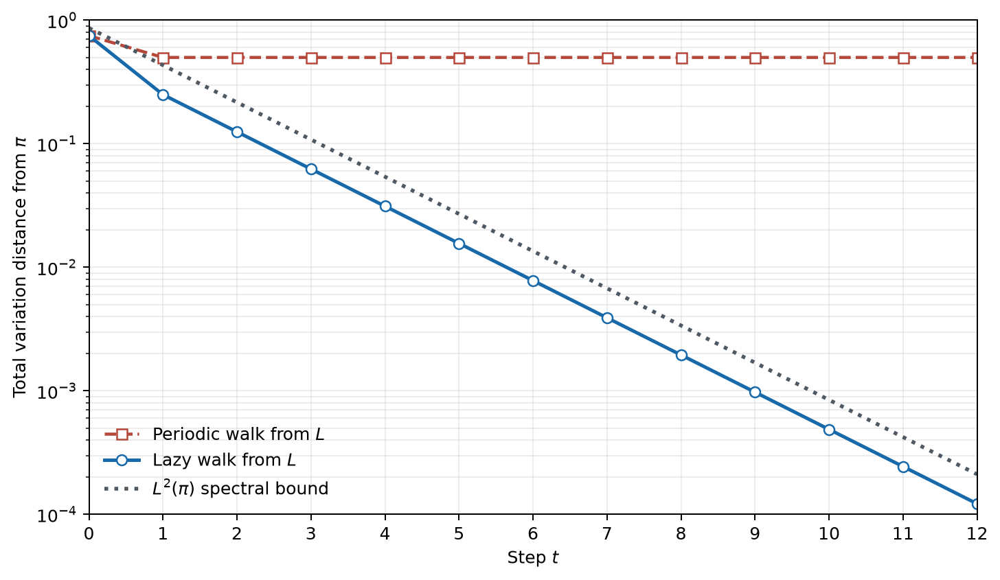

Imagine three rooms arranged in a corridor:

$$
L \longleftrightarrow M \longleftrightarrow R.
$$

A walker at an end room must move to the middle. From the middle, she chooses
the left or right room with equal probability. The rule is random, the corridor
is connected, and the chain has a unique stationary distribution.

It still refuses to settle.

Starting from $L$, the walker is in $M$ after every odd number of steps and at
one of the two ends after every positive even number. The chain knows the parity
of the clock forever. It has a stationary distribution, but it does not forget
when it began.

Now change one detail. At every step, toss a fair coin. On heads, stay where you
are. On tails, make the old move. This half-lazy walk converges rapidly to the
same stationary distribution.

The qualitative question was answered in
[*Markov Chains: When Probability Becomes Motion*](../markov-chains-when-probability-becomes-motion/):
finite irreducible aperiodic chains converge. Here the question is sharper.

**How much memory remains after $t$ steps, and what part of the matrix sets the
clock for its decay?**

The answer requires two changes of representation. First, memory becomes a
distance between probability distributions. Then that distance is controlled
by splitting the error into spectral modes. In a finite lazy reversible chain,
the stationary mode survives, every other mode shrinks, and the slowest one is
measured by the spectral gap.

## A ruler for remaining memory

Let $\mu$ and $\nu$ be probability distributions on a finite state space
$S$. Their **total variation distance** is

$$
\|\mu-\nu\|_{\mathrm{TV}}
=\frac12\sum_{x\in S}|\mu(x)-\nu(x)|.
$$ {#eq-tv-sum}

There is an equivalent, more operational form:

$$
\|\mu-\nu\|_{\mathrm{TV}}
=\max_{A\subseteq S}|\mu(A)-\nu(A)|.
$$ {#eq-tv-event}

To see why, let $B=\{x:\mu(x)\geq\nu(x)\}$. The positive discrepancies on
$B$ must have the same total mass as the negative discrepancies on its
complement, because both distributions sum to one. The event $B$ therefore
captures exactly half of the absolute discrepancy in @eq-tv-sum, and no other
event can capture more.

Equation @eq-tv-event gives the distance its meaning. If
$\|\mu-\nu\|_{\mathrm{TV}}\leq\varepsilon$, then the probabilities assigned
by $\mu$ and $\nu$ to *every* event differ by at most $\varepsilon$. The
distance asks for the event that can best distinguish the two distributions.

For a transition matrix $P$ with stationary distribution $\pi$, define

$$
d(t)=\max_{x\in S}\|P^t(x,\cdot)-\pi\|_{\mathrm{TV}}.
$$ {#eq-worst-distance}

Here $P^t(x,\cdot)$ is the distribution after $t$ steps when the chain begins
at state $x$. The **mixing time** at tolerance $\varepsilon$ is

$$
t_{\mathrm{mix}}(\varepsilon)
=\min\{t\geq0:d(t)\leq\varepsilon\}.
$$ {#eq-mixing-time}

Advancing a chain cannot increase total variation. Indeed,

$$
\begin{aligned}
\|\mu P-\nu P\|_{\mathrm{TV}}
&=\frac12\sum_y
\left|\sum_x(\mu(x)-\nu(x))P(x,y)\right|\\
&\leq\frac12\sum_x|\mu(x)-\nu(x)|\sum_yP(x,y)\\
&=\|\mu-\nu\|_{\mathrm{TV}}.
\end{aligned}
$$ {#eq-tv-contraction}

Thus $d(t)$ is non-increasing. This fact says that a Markov step cannot create
new information about the initial distribution. It does not say that any
information must disappear. The periodic corridor is the warning.

These definitions and their equivalent forms are standard; see Chapter 4 of
Levin and Peres [@levinperes2017markov].

## The same ruler as a meeting problem

Total variation also has a probabilistic interpretation. A **coupling** of
$\mu$ and $\nu$ is a pair of random variables $(U,V)$ defined on the same
probability space such that $U$ has law $\mu$ and $V$ has law $\nu$. Their
dependence is ours to choose.

For any event $A$,

$$
\begin{aligned}
\mu(A)-\nu(A)
&=\Pr(U\in A)-\Pr(V\in A)\\
&\leq\Pr(U\in A,V\notin A)\\
&\leq\Pr(U\neq V).
\end{aligned}
$$

The same argument with $\mu$ and $\nu$ exchanged gives

$$
\|\mu-\nu\|_{\mathrm{TV}}\leq\Pr(U\neq V)
$$ {#eq-coupling-inequality}

for every coupling. An optimal coupling attains equality. One way to see the
construction is to place the shared mass $\min\{\mu(x),\nu(x)\}$ on the
diagonal event $U=V=x$. Its total is

$$
\sum_x\min\{\mu(x),\nu(x)\}
=1-\|\mu-\nu\|_{\mathrm{TV}}.
$$

The remaining masses can be paired off the diagonal. Total variation is
therefore the smallest possible probability that two realisations of the two
laws disagree.

For a Markov chain, one can start $X_0=x$ and draw $Y_0$ from $\pi$, then use
shared randomness to evolve them while preserving the correct transition law
for each copy. If the construction makes the chains stay together after their
first meeting time $\tau$, then

$$
\|P^t(x,\cdot)-\pi\|_{\mathrm{TV}}
\leq\Pr(\tau>t).
$$

This is a second route to mixing bounds. We will not build a specialised
coupling here because the spectral route exposes the matrix mechanism more
directly. The interpretation is still useful: forgetting means that two copies
with different histories can be made overwhelmingly likely to agree now.

## The corridor that keeps the clock

Order the states as $L,M,R$. The original walk has transition matrix

$$
Q=
\begin{pmatrix}
0&1&0\\
\tfrac12&0&\tfrac12\\
0&1&0
\end{pmatrix}.
$$ {#eq-periodic-corridor}

Its stationary distribution is

$$
\pi=\left(\frac14,\frac12,\frac14\right).
$$ {#eq-corridor-stationary}

The middle room receives twice the stationary mass of either end because it has
twice as many incident corridor edges. Direct multiplication confirms
$\pi Q=\pi$.

Starting from $L$, the first two distributions are

$$
(1,0,0)Q=(0,1,0),
\qquad
(1,0,0)Q^2=\left(\frac12,0,\frac12\right).
$$

They then alternate forever. Each has total variation distance $1/2$ from
$\pi$. Connectivity gives a unique stationary law, but the rigid even-odd
clock prevents convergence.

The half-lazy version is

$$
P=\frac12(I+Q)
=
\begin{pmatrix}
\tfrac12&\tfrac12&0\\
\tfrac14&\tfrac12&\tfrac14\\
0&\tfrac12&\tfrac12
\end{pmatrix}.
$$ {#eq-lazy-corridor}

It preserves the stationary distribution because

$$
\pi P=\frac12(\pi+\pi Q)=\pi.
$$

From the left room,

$$
\begin{aligned}
\mu_0&=(1,0,0),\\
\mu_1&=\left(\frac12,\frac12,0\right),\\
\mu_2&=\left(\frac38,\frac12,\frac18\right).
\end{aligned}
$$

Their distances from stationarity are respectively

$$
\frac34,\qquad \frac14,\qquad \frac18.
$$

After the first step, the remaining discrepancy is halved at every step. The
coin did more than slow the walk down. It broke the parity clock.

## Reversibility reveals the right geometry

The matrix in @eq-lazy-corridor is not symmetric in the usual Euclidean sense:
$P(L,M)=1/2$ while $P(M,L)=1/4$. The stationary weights repair the apparent
asymmetry:

$$
\pi(x)P(x,y)=\pi(y)P(y,x)
\qquad\text{for all }x,y\in S.
$$ {#eq-detailed-balance}

These are the **detailed balance equations**. A chain satisfying them is
**reversible** with respect to $\pi$. Each side of @eq-detailed-balance is the
stationary probability flow across the directed edge. Reversibility says that,
at stationarity, the flow balances edge by edge.

In the spectral discussion below, $\pi$ is strictly positive, as it is for the
stationary distribution of any finite irreducible chain. This makes the
weighted inner product non-degenerate and $D^{-1/2}$ well defined.

Summing @eq-detailed-balance over $x$ gives

$$
\sum_x\pi(x)P(x,y)
=\pi(y)\sum_xP(y,x)
=\pi(y),
$$

so detailed balance implies stationarity. The converse is false: total incoming
and outgoing flow may balance even when individual edges carry a net current.

The real reward is geometric. For functions $f,g:S\to\mathbb R$, define the
weighted inner product

$$
\langle f,g\rangle_\pi
=\sum_{x\in S}\pi(x)f(x)g(x).
$$ {#eq-weighted-inner-product}

Using detailed balance and swapping the two state labels,

$$
\begin{aligned}
\langle f,Pg\rangle_\pi
&=\sum_{x,y}\pi(x)P(x,y)f(x)g(y)\\
&=\sum_{x,y}\pi(y)P(y,x)f(x)g(y)\\
&=\langle Pf,g\rangle_\pi.
\end{aligned}
$$ {#eq-self-adjoint}

So $P$ is self-adjoint, not under the unweighted dot product, but under the
geometry chosen by its stationary distribution. Equivalently, if
$D=\operatorname{diag}(\pi)$, then

$$
D^{1/2}PD^{-1/2}
$$

is an ordinary real symmetric matrix. The
[*Spectral Theorem for Symmetric Matrices*](../spectral-theorem/) can now do its
work. A finite reversible transition operator has a real orthonormal basis of
eigenfunctions in $L^2(\pi)$.

This is the decisive change of representation. The transition matrix looked
asymmetric because the rooms do not carry equal stationary weight. In the
correct weighted coordinates, its modes stand at right angles.

## Memory becomes a sum of modes

Assume for the moment that $P$ is finite, irreducible, reversible, and lazy.
Here **lazy** means $P(x,x)\geq1/2$ for every state. Order its eigenvalues as

$$
1=\lambda_1>\lambda_2\geq\cdots\geq\lambda_m\geq0.
$$ {#eq-lazy-spectrum}

Irreducibility makes the eigenvalue $1$ simple. Its eigenfunction is the
constant function $\mathbf1$. Laziness explains the final inequality. Writing
$P=(I+R)/2$ makes $R=2P-I$ another reversible transition matrix. If $\theta$ is
an eigenvalue of $R$, then $(1+\theta)/2$ is an eigenvalue of $P$. Since every
eigenvalue of a stochastic matrix has modulus at most one, the new eigenvalue
lies in $[0,1]$.

Let $\mu_t=\mu_0P^t$. Instead of tracking $\mu_t$ directly, measure its
density error relative to stationarity:

$$
h_t(y)=\frac{\mu_t(y)}{\pi(y)}-1.
$$ {#eq-density-error}

This error has weighted mean zero. Reversibility gives an especially clean
evolution law:

$$
h_{t+1}=Ph_t.
$$ {#eq-error-evolution}

For example, the coordinate at $y$ follows from

$$
\begin{aligned}
h_{t+1}(y)
&=\frac{\sum_x\mu_t(x)P(x,y)}{\pi(y)}-1\\
&=\sum_xP(y,x)h_t(x)\\
&=(Ph_t)(y),
\end{aligned}
$$

where detailed balance converts the forward flow into the reversed index.

Expand the initial error in an orthonormal eigenbasis
$f_1=\mathbf1,f_2,\ldots,f_m$. Its mean-zero property removes the stationary
component:

$$
h_0=\sum_{k=2}^m a_kf_k.
$$

After $t$ steps,

$$
\boxed{
h_t=P^th_0=\sum_{k=2}^m a_k\lambda_k^t f_k.
}
$$ {#eq-spectral-error}

Every coefficient records one pattern of initial imbalance. The chain does not
erase all patterns at the same rate. It multiplies the $k$th pattern by
$\lambda_k$ at each step. Modes with small eigenvalues disappear quickly;
modes with eigenvalues near one linger.

The **spectral gap** is

$$
\gamma=1-\lambda_2.
$$ {#eq-spectral-gap}

It is the distance between the stationary eigenvalue and the slowest remaining
eigenvalue. A large gap leaves no long-lived non-stationary mode. A small gap
leaves at least one pattern that the chain can only slowly flatten.

## Turning the gap into a mixing bound

The spectral picture becomes a total variation estimate with one application
of Cauchy--Schwarz.

::: {#thm-spectral-mixing .theorem}
## Spectral mixing bound

Let $P$ be the transition matrix of a finite, irreducible, lazy, reversible
Markov chain on at least two states, with stationary distribution $\pi$. Let
$\gamma=1-\lambda_2$ and $\pi_{\min}=\min_x\pi(x)$. Then, for every state $x$
and integer $t\geq0$,

$$
\|P^t(x,\cdot)-\pi\|_{\mathrm{TV}}
\leq
\frac12\sqrt{\frac1{\pi(x)}-1}\,\lambda_2^t
\leq
\frac{1}{2\sqrt{\pi_{\min}}}e^{-\gamma t}.
$$ {#eq-spectral-tv-bound}

Consequently, for $0<\varepsilon<1/2$,

$$
t_{\mathrm{mix}}(\varepsilon)
\leq
\left\lceil
\frac1\gamma
\log\!\left(\frac{1}{2\varepsilon\sqrt{\pi_{\min}}}\right)
\right\rceil.
$$ {#eq-spectral-time-bound}
:::

::: {.proof}
Let $h_t$ be the density error from @eq-density-error for a chain started at
$x$. By @eq-spectral-error and the eigenvalue ordering,

$$
\|h_t\|_{2,\pi}
\leq\lambda_2^t\|h_0\|_{2,\pi}.
$$

For the point mass at $x$, direct calculation gives

$$
\|h_0\|_{2,\pi}^2
=\sum_y\pi(y)
\left(\frac{\mathbf1_{\{y=x\}}}{\pi(y)}-1\right)^2
=\frac1{\pi(x)}-1.
$$

Meanwhile, @eq-tv-sum and Cauchy--Schwarz give

$$
\begin{aligned}
\|P^t(x,\cdot)-\pi\|_{\mathrm{TV}}
&=\frac12\sum_y\pi(y)|h_t(y)|\\
&\leq\frac12\|h_t\|_{2,\pi}.
\end{aligned}
$$

Combining the three displays proves the first inequality in
@eq-spectral-tv-bound. The second uses
$\sqrt{1/\pi(x)-1}\leq1/\sqrt{\pi_{\min}}$ and
$(1-\gamma)^t\leq e^{-\gamma t}$. Solving the resulting inequality for $t$
gives @eq-spectral-time-bound.
:::

The prefactor involving $\pi_{\min}$ can be loose. The important structural
term is the exponential clock $e^{-\gamma t}$, or equivalently the
**relaxation time** $1/\gamma$.

There is also a matching obstruction. For the same irreducible reversible
chain, let $f$ be a non-constant eigenfunction with eigenvalue
$\lambda\neq1$, normalised so that $\|f\|_\infty=1$. Orthogonality to the
constant eigenfunction makes its stationary mean zero. Choose $x$ with
$|f(x)|=1$. The variational form of total variation then gives

$$
\begin{aligned}
2\|P^t(x,\cdot)-\pi\|_{\mathrm{TV}}
&\geq
\left|\mathbb E_x[f(X_t)]-\mathbb E_\pi[f]\right|\\
&=|P^tf(x)|\\
&=|\lambda|^t.
\end{aligned}
$$ {#eq-eigenvalue-lower-bound}

So an eigenvalue near one is not merely an artefact of the upper-bound proof.
For some starting state, its eigenfunction carries memory that survives at
least as long as $|\lambda|^t/2$. Standard treatments develop these upper and
lower spectral estimates in greater generality
[@levinperes2017markov, ch. 12; @aldousfill2002reversible].

## The gap as resistance to smoothing

The formula $\gamma=1-\lambda_2$ defines the gap spectrally. A variational
formula explains what kind of geometry makes it small.

For a finite reversible chain, define the **Dirichlet energy** of a function
$f:S\to\mathbb R$ by

$$
\mathcal E(f,f)
=\langle f,(I-P)f\rangle_\pi.
$$ {#eq-dirichlet-definition}

Detailed balance rewrites this as

$$
\boxed{
\mathcal E(f,f)
=\frac12\sum_{x,y}\pi(x)P(x,y)
\bigl(f(x)-f(y)\bigr)^2.
}
$$ {#eq-dirichlet-edges}

To verify the identity, expand the square. The two squared terms each sum to
$\langle f,f\rangle_\pi$, using stationarity for one and stochasticity for the
other. The cross term is $2\langle f,Pf\rangle_\pi$. Division by two leaves
@eq-dirichlet-definition.

The right side of @eq-dirichlet-edges only charges an edge when its endpoints
assign different values to $f$. The energy is small when $f$ changes little
across transitions that carry substantial stationary flow.

Write

$$
\operatorname{Var}_\pi(f)
=\|f-\mathbb E_\pi f\|_{2,\pi}^2.
$$

Then the spectral gap has the Rayleigh-quotient characterisation

$$
\boxed{
\gamma
=\min_{\operatorname{Var}_\pi(f)>0}
\frac{\mathcal E(f,f)}{\operatorname{Var}_\pi(f)}.
}
$$ {#eq-gap-rayleigh}

Indeed, expand $f-\mathbb E_\pi f=\sum_{k=2}^m a_kf_k$. Orthogonality gives

$$
\operatorname{Var}_\pi(f)=\sum_{k=2}^m a_k^2,
\qquad
\mathcal E(f,f)=\sum_{k=2}^m(1-\lambda_k)a_k^2.
$$

Their ratio is a weighted average of the numbers $1-\lambda_k$. Its minimum is
$1-\lambda_2$, attained by a $\lambda_2$ eigenfunction. This is the finite
reversible Poincaré inequality in spectral form
[@levinperes2017markov, sec. 13.2].

Now the geometry is visible. Suppose a state space has two large regions joined
by only a weak stationary flow. A function that is nearly constant on each
region but takes different values between them can have substantial variance
and very little edge energy. Equation @eq-gap-rayleigh then forces the gap to
be small. The chain takes a long time to carry enough probability through the
thin connection to erase which side it started on.

For the lazy corridor, take $f=(1,0,-1)$. Its stationary mean is zero,
$\operatorname{Var}_\pi(f)=1/2$, and
$\mathcal E(f,f)=1/4$. The quotient is $1/2$, exactly the spectral gap.

For a non-lazy reversible chain, @eq-gap-rayleigh still describes the ordinary
gap $1-\lambda_2$. Negative eigenvalues are a separate obstruction to mixing,
which is why the absolute gap returns in the boundary discussion below.

## The corridor in spectral coordinates

For the periodic matrix $Q$ in @eq-periodic-corridor, the eigenvalues are

$$
1,\quad 0,\quad -1.
$$

The eigenvalue $-1$ is the parity clock. Its magnitude is one, so the
corresponding imbalance never shrinks. Its sign flips at every step.

Lazification applies the map

$$
\lambda\longmapsto\frac{1+\lambda}{2}
$$

to every eigenvalue. The lazy matrix $P$ therefore has spectrum

$$
1,\quad \frac12,\quad 0.
$$

The parity mode $-1$ is sent to $0$ and vanishes after one step. The remaining
non-stationary mode has eigenfunction proportional to

$$
f=(1,0,-1),
$$

which records a left-versus-right imbalance. It is multiplied by $1/2$ at each
step. Hence $\gamma=1/2$, and for a start at $L$,

$$
\|P^t(L,\cdot)-\pi\|_{\mathrm{TV}}
=2^{-(t+1)}
\qquad(t\geq1).
$$ {#eq-corridor-exact-tv}

The spectral gap does not merely predict an exponential shape here. It gives
the exact ratio between consecutive errors once the zero mode has disappeared.
The right endpoint behaves symmetrically, while a start at $M$ reaches $\pi$
after one lazy step. Consequently,

$$
d(0)=\frac34,
\qquad
d(t)=2^{-(t+1)}\quad(t\geq1).
$$

For $0<\varepsilon\leq1/4$, the exact mixing time is therefore

$$
t_{\mathrm{mix}}(\varepsilon)
=\left\lceil\log_2\!\left(\frac1{2\varepsilon}\right)\right\rceil.
$$ {#eq-corridor-mixing-time}

At one per cent tolerance, six steps suffice. The general estimate
@eq-spectral-time-bound gives ten. That difference is expected: the theorem
uses only the gap and the smallest stationary mass, while the exact calculation
also knows that one mode vanishes immediately and that the remaining
eigenfunction has a favourable coefficient. A universal bound pays for
information it has deliberately discarded.

A deterministic calculation checks stochasticity, stationarity, detailed
balance, both spectra, all three deterministic starting states, and the
Dirichlet quotient. @fig-mixing-distance plots the resulting exact distances;
no Monte Carlo sampling is involved.

{#fig-mixing-distance fig-alt="A semilog plot of total variation distance against step number. The periodic walk remains at one half after the first step, while the lazy walk decays geometrically beneath its spectral bound." width="92%"}

The flat red curve is the surviving $-1$ mode. The blue curve is the surviving
$1/2$ mode. The grey bound is deliberately general: it must work for the worst
starting state without using the corridor's exact cancellation, so its
prefactor is larger than the observed error.

## Why a sampler cares about forgetting

Mixing is not only a statement about where a random walker eventually goes. It
is also the mathematical issue behind using a Markov chain to approximate a
target distribution.

Suppose an algorithm constructs a chain whose stationary law is the desired
distribution $\pi$. If the chain begins from an arbitrary state $x$, then its
law after $t$ steps is $P^t(x,\cdot)$ rather than exactly $\pi$. A mixing bound
turns the vague instruction "run it for a while" into a quantitative bias
statement. If

$$
\|P^t(x,\cdot)-\pi\|_{\mathrm{TV}}\leq\varepsilon,
$$

then every event probability is wrong by at most $\varepsilon$. More generally,
for any observable $g$ with $\|g\|_\infty\leq1$, the variational formula for
total variation gives

$$
\left|
\mathbb E_x[g(X_t)]-\mathbb E_\pi[g]
\right|
\leq2\varepsilon.
$$ {#eq-burn-in-bias}

This explains what a **burn-in** period can control: dependence on the chosen
initial state.

It does not make successive samples independent. Even when $X_0$ is already
distributed as $\pi$, the pair $(X_0,X_t)$ usually remains dependent. For a
mean-zero observable $f$, stationarity and reversibility give

$$
\operatorname{Cov}_\pi\bigl(f(X_0),f(X_t)\bigr)
=\langle f,P^tf\rangle_\pi.
$$ {#eq-stationary-covariance}

Expanding $f=\sum_{k=2}^m a_kf_k$ yields

$$
\operatorname{Cov}_\pi\bigl(f(X_0),f(X_t)\bigr)
=\sum_{k=2}^m a_k^2\lambda_k^t.
$$ {#eq-covariance-modes}

For a lazy reversible chain this is bounded in absolute value by

$$
\lambda_2^t\operatorname{Var}_\pi(f).
$$ {#eq-covariance-bound}

In the lazy corridor, the observable $f=(1,0,-1)$ asks whether the walker leans
left or right. It is exactly the $\lambda_2=1/2$ eigenfunction, so its
stationary covariance is

$$
\operatorname{Cov}_\pi\bigl(f(X_0),f(X_t)\bigr)
=2^{-(t+1)}.
$$

Here the upper bound is attained. The same left-right imbalance that governs
the worst starting state also governs this observable's serial dependence.

The same slow spectral mode therefore appears twice. It controls worst-case
forgetting of the start, and it can control the decay of correlation along a
stationary trajectory. The two tasks are still different. Burn-in addresses
initialisation bias; estimating Monte Carlo error requires accounting for the
dependence among the samples that remain. A particular $f$ may also have
$a_2=0$ and decorrelate faster than the worst-case rate.

This is why a spectral gap can be operationally important without becoming a
complete certificate for a sampling algorithm. It provides a time scale. The
accuracy of a final estimate also depends on the observable, the run length,
and how the transition rule was constructed.

## What the gap does not promise

The phrase "the second eigenvalue controls mixing" needs its conditions.

First, a reversible chain that is not lazy can have a large negative
eigenvalue. Ordering eigenvalues only by numerical value would then miss an
oscillating mode. For a general reversible chain, the relevant quantity is the
largest non-trivial absolute eigenvalue

$$
\lambda_*=\max_{k\geq2}|\lambda_k|,
$$

and the **absolute spectral gap** is $1-\lambda_*$. Laziness makes the spectrum
non-negative, so the ordinary and absolute gaps agree. The corridor shows why
this qualification matters: $Q$ has $\lambda_2=0$ but also has eigenvalue
$-1$, and it does not mix at all.

Second, a non-reversible transition matrix need not be self-adjoint in
$L^2(\pi)$. Its eigenvalues may be complex, its eigenvectors may fail to be
orthogonal, and a non-normal matrix can show transient behaviour that its
eigenvalue magnitudes alone do not capture. Singular values,
reversibilisations, coupling, or other tools may be needed. The proof above
must not be copied into that setting with the word "reversible" silently
removed.

Third, in the lazy reversible setting, a small gap identifies a slow mode, not
a universal speed for every question. If an initial distribution or an
observable is orthogonal to the $\lambda_2$ eigenfunction, its coefficient
$a_2$ in @eq-spectral-error is zero and it can forget faster. The spectral gap
governs the worst surviving direction.

Finally, the bound in @eq-spectral-time-bound may be far from sharp. The factor
$\pi_{\min}$ treats the rarest state as a worst-case starting point and ignores
finer geometry. Bottleneck, coupling, conductance, and log-Sobolev methods can
reveal more. This article establishes the spectral clock, not the entire theory
of mixing.

## What to remember

A Markov chain forgets its beginning only after we decide what
"indistinguishable" means. Total variation supplies a demanding answer: no
event should retain much ability to tell the current law from stationarity.

Reversibility then chooses the correct geometry. In the weighted space
$L^2(\pi)$, the transition operator is self-adjoint, so the initial density
error splits into orthogonal eigenmodes. One mode is constant and survives.
Every other mode is repeatedly multiplied by its eigenvalue.

For a finite lazy reversible chain, the spectral gap is the separation between
the stationary mode and the slowest remaining mode. Its reciprocal is the
natural time scale for forgetting. The corridor also records the boundary:
without laziness or an absolute-value correction, a negative eigenvalue can
preserve a clock forever.

The next step in this series will move from probability flowing between states
to heat flowing across a network. The graph Laplacian will turn the same basic
question into continuous-time diffusion.

## How to cite

Fang, X. (2026). "Mixing: How a Markov Chain Forgets Its Beginning."
*Math Notes*. <https://terryfxh.github.io/math-notes/posts/mixing-how-a-markov-chain-forgets/>
